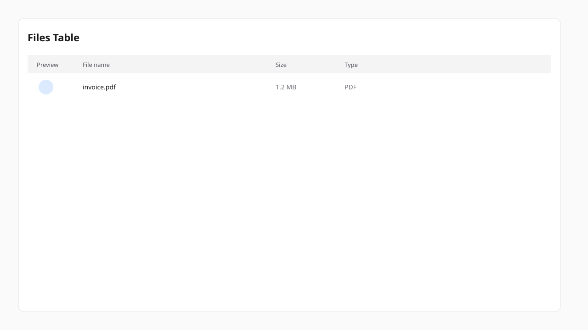
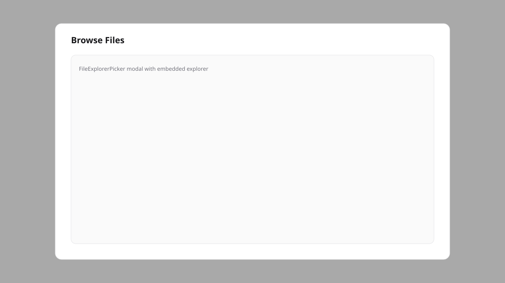
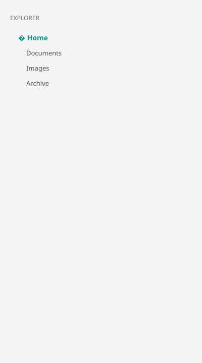
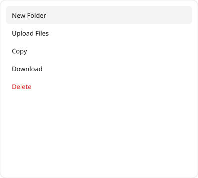
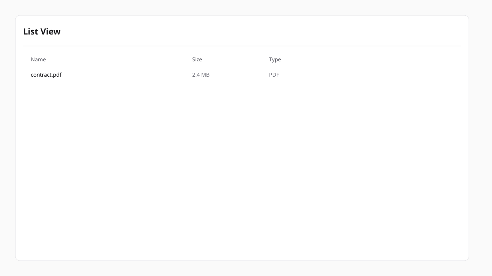

# Filament File Explorer

Finder-style file explorer for **Filament v4 and v5**, powered by **Spatie Media Library**.


## Features

- macOS Finder-style UI: sidebar tree, breadcrumbs, back/forward navigation
- View modes: icons (grid), list, columns (table), details
- Clipboard: cut, copy, paste folders and files
- Multi-select with marquee selection
- Context menu, drag-and-drop upload, folder zip download
- **Filament plugin** with auto-loaded CSS/JS assets
- Reusable **files table** concern for Filament resources
- **Form picker** field to browse files in modals
- Generic **`scopeKey` + `rootFolderId`** API — no domain coupling
- Authorization via **`FileExplorerAuthorizer`** contract

## Requirements

| Package | Version |
|---------|---------|
| PHP | 8.2+ |
| Laravel | 11, 12, or 13 |
| Filament | 4.x or 5.x |
| Livewire | 3.x (Filament 4) or 4.x (Filament 5) |
| Spatie Media Library | 11.x |

## Installation

```bash
composer require ardavan/filament-file-explorer:"^1.0" -W

php artisan vendor:publish --provider="Spatie\MediaLibrary\MediaLibraryServiceProvider" --tag="medialibrary-migrations"
php artisan filament-file-explorer:install
php artisan migrate
```

Register the plugin in your panel provider:

```php
use Ardavan\FilamentFileExplorer\FilamentFileExplorerPlugin;

public function panel(Panel $panel): Panel
{
    return $panel
        ->plugin(FilamentFileExplorerPlugin::make());
}
```

Bind your authorizer (optional — demo uses allow-all):

```php
use Ardavan\FilamentFileExplorer\Contracts\FileExplorerAuthorizer;

$this->app->singleton(FileExplorerAuthorizer::class, App\Support\YourFileExplorerAuthorizer::class);
```

Or configure via plugin:

```php
FilamentFileExplorerPlugin::make()
    ->authorizer(App\Support\YourFileExplorerAuthorizer::class);
```

## Quick start

### 1. Create a root folder

```php
use Ardavan\FilamentFileExplorer\Facades\FileExplorer;

$root = FileExplorer::createRoot('Project Files', 'project-files');
$record->update(['folder_id' => $root->id]);
```

### 2. Embed explorer in a Filament page

```php
use Ardavan\FilamentFileExplorer\Pages\Concerns\InteractsWithFileExplorer;

class ProjectFilesPage extends Page
{
    use InteractsWithFileExplorer;

    protected string $view = 'filament-file-explorer::filament.pages.file-explorer';

    public function mount(int|string $record): void
    {
        $this->record = $this->resolveRecord($record);
        $this->mountFileExplorer();
    }

    protected function fileExplorerScopeKey(): string
    {
        return 'project.'.$this->record->getKey();
    }

    protected function resolveFileExplorerRootFolderId(): int
    {
        return (int) $this->record->folder_id;
    }
}
```



### 3. Files table on a resource sub-page

```php
use Ardavan\FilamentFileExplorer\Tables\Concerns\InteractsWithFileExplorerTable;

class ListProjectFiles extends Page implements HasTable
{
    use InteractsWithTable;
    use InteractsWithFileExplorerTable;

    public function table(Table $table): Table
    {
        return $this->configureFileExplorerTable($table);
    }

    protected function fileExplorerScopeKey(): string
    {
        return 'project.'.$this->record->getKey();
    }

    protected function fileExplorerRootFolderId(): int
    {
        return (int) $this->record->folder_id;
    }

    protected function fileExplorerExplorerUrl(?int $folderId = null): string
    {
        $url = ProjectFilesExplorerPage::getUrl(['record' => $this->record]);

        return $folderId ? $url.'?folder='.$folderId : $url;
    }
}
```



### 4. Form field picker

```php
use Ardavan\FilamentFileExplorer\Forms\Components\FileExplorerPicker;

FileExplorerPicker::make('attachment_ids')
    ->scopeKey('project.'.$record->id)
    ->rootFolderId($record->folder_id)
    ->multiple();
```

## Documentation

- [Installation](docs/installation.md)
- [Authorization](docs/authorization.md)
- [Explorer page](docs/explorer-page.md)
- [Files table](docs/files-table.md)
- [Form picker](docs/form-picker.md)
- [Configuration](docs/configuration.md)

## UI previews

| Explorer (grid) | Sidebar tree | Context menu |
|-----------------|--------------|--------------|
|  |  |  |

| List view | Dark mode |
|-----------|-----------|
|  |  |

## Publishing to Filament plugins directory

1. Push to public GitHub and Packagist
2. Request author access at [filamentphp.com/author](https://filamentphp.com/author)
3. Submit plugin with hero image (2560×1440 JPEG, 16:9)
4. Tag: dark mode, multilingual

## License

MIT © Ardavan
