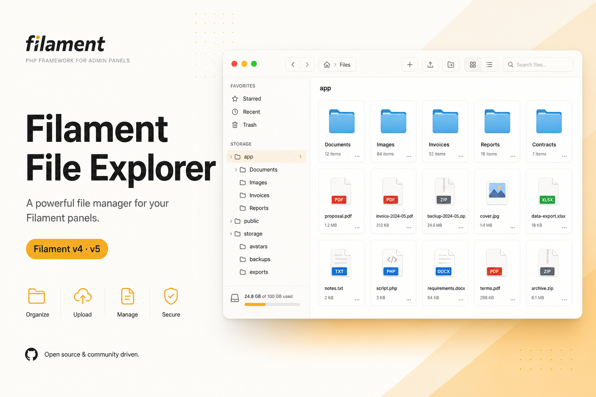
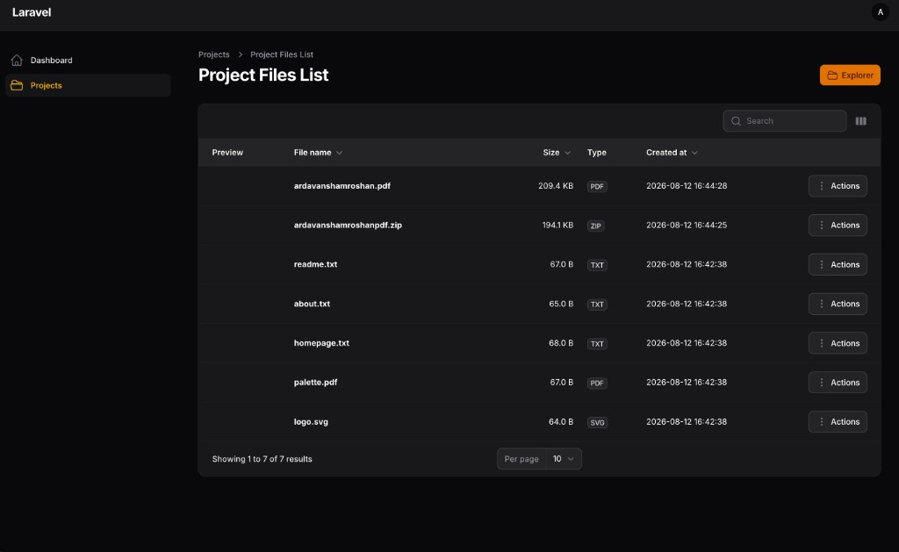

<p align="center">
  <a href="https://ardavanshamroshan.github.io/filament-file-explorer/">
    
  </a>
</p>

<h1 align="center">Filament File Explorer</h1>

<p align="center">
  <strong>Finder-style file manager for Filament v4 &amp; v5</strong><br>
  Powered by Spatie Media Library · Livewire · Tailwind
</p>

<p align="center">
  <a href="https://ardavanshamroshan.github.io/filament-file-explorer/"></a>
  <a href="https://packagist.org/packages/ardavan/filament-file-explorer"></a>
  <a href="https://packagist.org/packages/ardavan/filament-file-explorer"></a>
  <a href="LICENSE"></a>
</p>

<p align="center">
  <a href="https://ardavanshamroshan.github.io/filament-file-explorer/">Documentation</a> ·
  <a href="https://ardavanshamroshan.github.io/filament-file-explorer/guide/installation.html">Installation</a> ·
  <a href="https://ardavanshamroshan.github.io/filament-file-explorer/guide/explorer.html">Explorer</a> ·
  <a href="https://ardavanshamroshan.github.io/filament-file-explorer/#screenshots">Screenshots</a> ·
  <a href="https://github.com/ardavanshamroshan/filament-file-explorer/issues">Issues</a>
</p>

---

## Navigation

| | |
|---|---|
| **Product** | [Features](#features) · [Screenshots](#screenshots) · [Requirements](#requirements) |
| **Start** | [Installation](#installation) · [Quickstart](#quickstart) · [Commands](#commands) |
| **Guides** | [Explorer](https://ardavanshamroshan.github.io/filament-file-explorer/guide/explorer.html) · [Files table](https://ardavanshamroshan.github.io/filament-file-explorer/guide/files-table.html) · [Form picker](https://ardavanshamroshan.github.io/filament-file-explorer/guide/form-picker.html) · [Authorization](https://ardavanshamroshan.github.io/filament-file-explorer/guide/authorization.html) · [Configuration](https://ardavanshamroshan.github.io/filament-file-explorer/guide/configuration.html) |
| **Site** | [🌐 Documentation website](https://ardavanshamroshan.github.io/filament-file-explorer/) · [Packagist](https://packagist.org/packages/ardavan/filament-file-explorer) |

---

## Features

- **Finder UI** — sidebar tree, breadcrumbs, back / forward, responsive toolbar with **⋮** overflow
- **Views** — icons (grid), list, table, details + Get Info inspector
- **Files** — MIME icons (PDF, Office, zip, audio, video), extensions on labels, dark-mode contrast
- **Ops** — drag-and-drop upload, clipboard (cut / copy / paste), marquee multi-select, zip download
- **Filament** — plugin assets, `HasFileExplorer` trait, stub generators, files table page, form picker
- **API** — generic `scopeKey` + `rootFolderId`, `FileExplorerAuthorizer` contract
- **i18n** — en, fa, ar, de, nl, fr, es, pt, tr, ru, zh_CN, ja, it, hi, id

---

## Screenshots

| Grid | List + Get Info |
|------|-----------------|
|  |  |

| Context menu | Files table |
|--------------|-------------|
|  |  |

---

## Requirements

| Package | Version |
|---------|---------|
| PHP | 8.2+ |
| Laravel | 11 / 12 / 13 |
| Filament | 4.x or 5.x |
| Livewire | 3.x (Filament 4) or 4.x (Filament 5) |
| Spatie Media Library | 11.x |

---

## Installation

```bash
composer require ardavan/filament-file-explorer:"^0.5" -W

php artisan vendor:publish --provider="Spatie\MediaLibrary\MediaLibraryServiceProvider" --tag="medialibrary-migrations"
php artisan filament-file-explorer:install --migrate
php artisan vendor:publish --tag=filament-file-explorer-assets --force
```

Register the plugin:

```php
use Ardavan\FilamentFileExplorer\FilamentFileExplorerPlugin;

public function panel(Panel $panel): Panel
{
    return $panel
        ->viteTheme('resources/css/filament/admin/theme.css')
        ->plugin(FilamentFileExplorerPlugin::make());
}
```

### Theme (required)

```css
/* resources/css/filament/admin/theme.css */
@import '../../../../vendor/filament/filament/resources/css/theme.css';

@source '../../../../app/Filament/**/*';
@source '../../../../resources/views/filament/**/*';
@source '../../../../vendor/ardavan/filament-file-explorer/resources/views/**/*.blade.php';
```

```bash
npm run build
php artisan filament:assets
```

> Full walkthrough: **[Installation guide →](https://ardavanshamroshan.github.io/filament-file-explorer/guide/installation.html)**

---

## Quickstart

```php
use Ardavan\FilamentFileExplorer\Models\Concerns\HasFileExplorer;

class Project extends Model
{
    use HasFileExplorer;
}
```

```bash
php artisan filament-file-explorer:make-folder-migration projects
php artisan migrate
php artisan filament-file-explorer:make-page ProjectResource
```

```php
use Ardavan\FilamentFileExplorer\Resources\Concerns\HasFileExplorerResource;

class ProjectResource extends Resource
{
    use HasFileExplorerResource;

    public static function getPages(): array
    {
        return [
            'index' => Pages\ListProjects::route('/'),
            'create' => Pages\CreateProject::route('/create'),
            'edit' => Pages\EditProject::route('/{record}/edit'),
            ...static::getFileExplorerPages(
                Pages\ManageProjectFiles::class,
                Pages\ListProjectFiles::class,
            ),
        ];
    }
}
```

Embed Livewire (Filament 5 / Livewire 4):

```blade
@livewire('filament-file-explorer::file-explorer', [
    'scopeKey' => 'project.'.$record->getKey(),
    'rootFolderId' => $record->folder_id,
], key('fe-'.$record->getKey()))
```

Or the dotted tag form: `<livewire:filament-file-explorer.file-explorer … />`.

---

## Commands

| Command | Purpose |
|---------|---------|
| `filament-file-explorer:install` | Publish config (`--stubs`, `--migrate`) |
| `filament-file-explorer:make-page {Resource}` | Explorer + files list pages |
| `filament-file-explorer:make-folder-migration {table}` | Add `folder_id` |
| `filament-file-explorer:make-authorizer` | Authorizer class |

---

## Form picker

```php
use Ardavan\FilamentFileExplorer\Forms\Components\FileExplorerPicker;

FileExplorerPicker::make('attachment_ids')
    ->scopeKey($record->fileExplorerScopeKey())
    ->rootFolderId($record->fileExplorerRootFolderId())
    ->multiple();
```

---

## Documentation website

Designed in the spirit of [filamentphp.com](https://filamentphp.com) — amber CTAs, bone surfaces, screenshot gallery, and guide nav.

**→ [ardavanshamroshan.github.io/filament-file-explorer](https://ardavanshamroshan.github.io/filament-file-explorer/)**

Markdown mirrors (repo): [installation](docs/installation.md) · [explorer](docs/explorer-page.md) · [files table](docs/files-table.md) · [picker](docs/form-picker.md) · [auth](docs/authorization.md) · [config](docs/configuration.md)

---

## Translations

`en` · `fa` · `ar` · `de` · `nl` · `fr` · `es` · `pt` · `tr` · `ru` · `zh_CN` · `ja` · `it` · `hi` · `id`

```bash
php artisan vendor:publish --tag=filament-file-explorer-translations
```

---

## Development

```bash
composer install
./vendor/bin/pest
./vendor/bin/pint
```

---

## License

MIT © [Ardavan Shamroshan](https://github.com/ardavanshamroshan)
