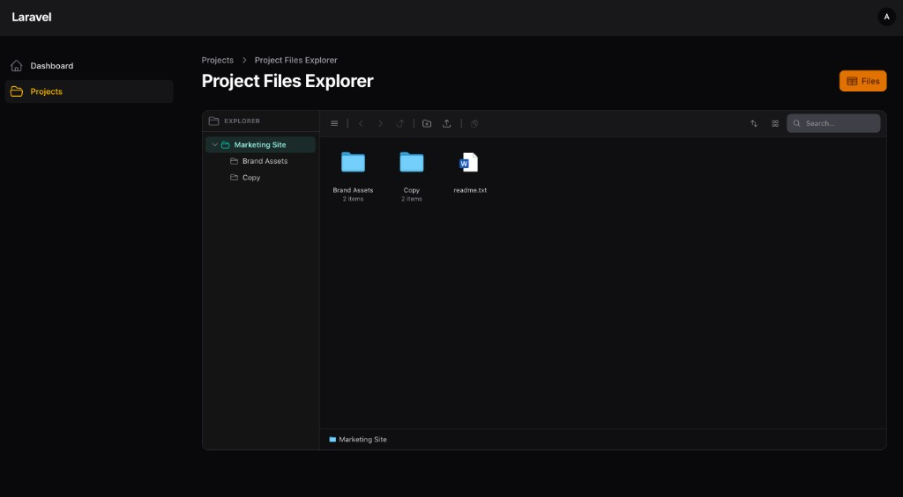
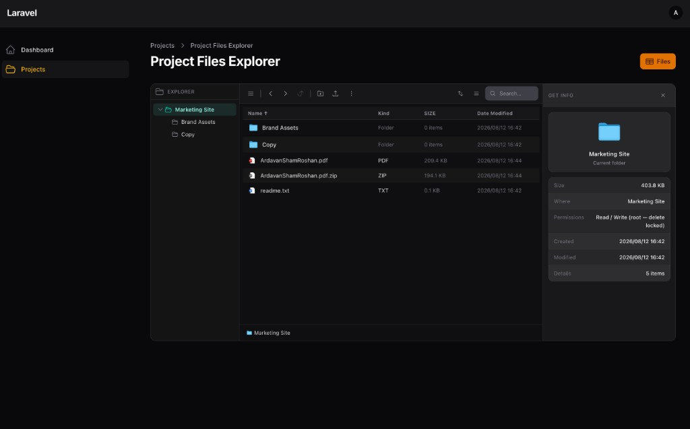
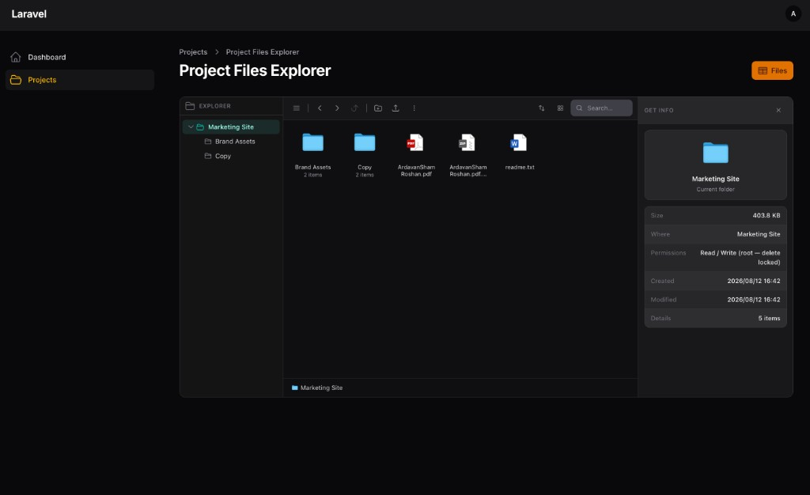
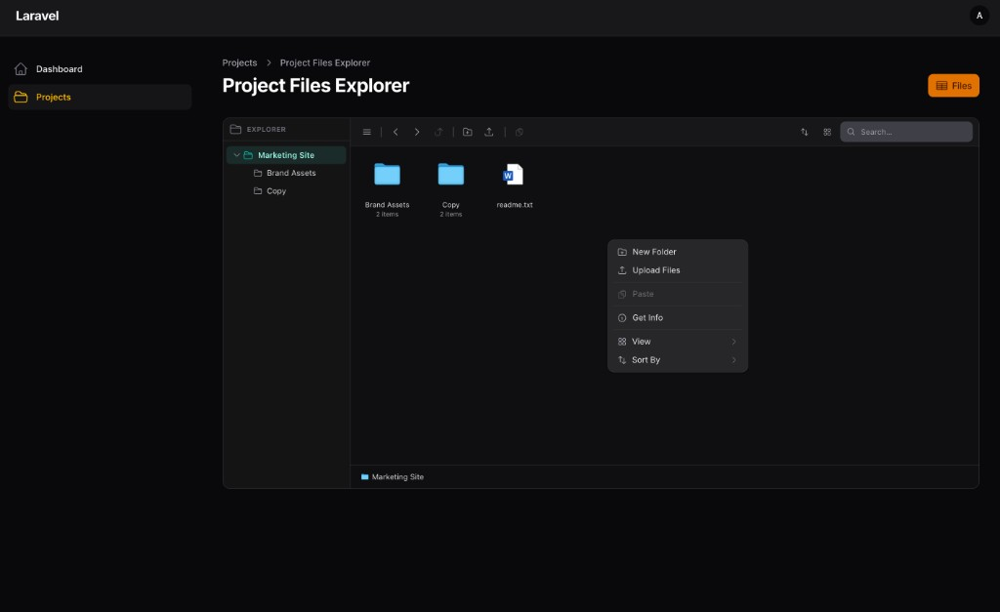

# Explorer page

Prefer `HasFileExplorer` on the model, then generate a thin page:

```bash
php artisan filament-file-explorer:make-page ProjectResource --explorer
```

```php
use Ardavan\FilamentFileExplorer\Pages\FileExplorerPage;

class ManageProjectFiles extends FileExplorerPage
{
    protected static string $resource = ProjectResource::class;
}
```

Page resolves `scopeKey` + `rootFolderId` from the model trait.

Override methods only when the model does **not** use `HasFileExplorer`.



Deep-link folder: `?folder={id}`.

### Views






